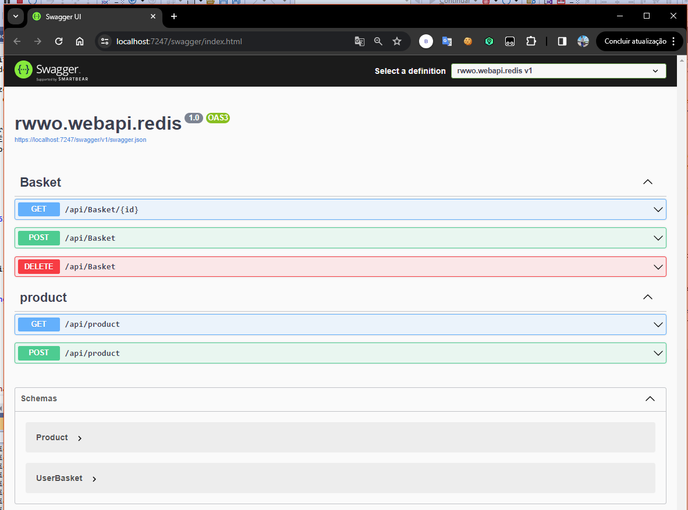

# Caching in .NET Core usando Redis

## O que é Caching?
Caching é uma técnica que permite aos desenvolvedores armazenar e recuperar dados ou cálculos mais frequentemente utilizados de maneira eficiente, 
reduzindo assim a necessidade de recriar ou buscar a mesma informação repetidamente.

* Em memória: Consiste em armazenar dados diretamente no espaço de memória do servidor de uma aplicação.
* Distribuído: Basicamente, os dados são armazenados e compartilhados entre vários servidores.

## Sobre o Redis
Redis (Remote Dictionary Server) é um sistema de armazenamento de dados em memória open-source que pode ser utilizado como cache, message broker (corretor de mensagens) 
e banco de dados chave-valor. É conhecido por sua alta performance, versatilidade e suporte a uma ampla gama de estruturas de dados. O Redis foi projetado para ser rápido,
escalável e confiável, tornando-se uma escolha popular para o desenvolvimento de aplicações em tempo real.
 

## Sobre o Projeto

1 - Rodar o redis

```
docker run --name redis -d -p 6379:6379 redis:latest
```

2 - Desenvolver a API

3 - Adicionar a conexão do redis no appsetting.json
```
  "ConnectionStrings": {
    "default": "connectionstring"
    "Redis": "localhost"
  }
```

4 - Adicionar as DI.




###


###

> [!NOTE]
> Projeto desenvolvido para fins de estudos.
